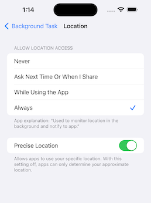
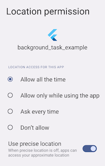

# background_task

[](https://neverjp.com)

Developed with 💙 by [Never inc](https://neverjp.com/).

---

## Motivation

Enable developers to continue processing even when the application transitions to the background, we have created a package that allows processing to continue using location updates.This package was created with reference to [background_location](https://pub.dev/packages/background_location).

Can be used when you want to run the program periodically in the background.

- Monitor and notify the distance walked and steps.
- Notification of destination arrival.
- Tracking location information (sending it to a server).

## Usage

```dart
// Monitor notifications of background processes.
// However, Cannot be used while the app is in task kill.
BackgroundTask.instance.stream.listen((event) {
  // Implement the process you want to run in the background.
  // ex) Check health data.
});

// Start background processing with location updates.
await BackgroundTask.instance.start();

// Stop background processing and location updates.
await BackgroundTask.instance.stop();
```

This is an implementation for receiving updates even when the task is task-killed. In this package, iOS uses [startMonitoringSignificantLocationChanges](https://developer.apple.com/documentation/corelocation/cllocationmanager/1423531-startmonitoringsignificantlocati) and Android uses [ForegroundService](https://developer.android.com/develop/background-work/services/foreground-services).

```dart
// Define callback handler at the top level.
@pragma('vm:entry-point')
void backgroundHandler(Location data) {
  // Implement the process you want to run in the background.
  // ex) Check health data.
}

void main() {
  WidgetsFlutterBinding.ensureInitialized();
  BackgroundTask.instance.setBackgroundHandler(backgroundHandler); // 👈 Set callback handler.
  runApp(const MyApp());
}
```

To get the latest location information in a task-killed status, set the app to Always.




This is an implementation for when you want to stop using the application when it is killed.

```dart
await BackgroundTask.instance.start(
  isEnabledEvenIfKilled: false,
);
```

Recommended to use with [permission_handler](https://pub.dev/packages/permission_handler).

```dart
final status = Platform.isIOS
    ? await Permission.locationAlways.request()
    : await Permission.location.request();
if (!status.isGranted) {
  return;
}
await BackgroundTask.instance.start();
```

### Setup

pubspec.yaml

```yaml
dependencies:
  background_task:
```

iOS: Info.plist

```xml
<key>NSLocationAlwaysAndWhenInUseUsageDescription</key>
<string>Used to monitor location in the background and notify to app.</string>
<key>NSLocationAlwaysUsageDescription</key>
<string>Used to monitor location in the background and notify to app.</string>
<key>NSLocationWhenInUseUsageDescription</key>
<string>Used to monitor location in the background and notify to app.</string>
<key>UIBackgroundModes</key>
<array>
    <string>fetch</string>
    <string>location</string>
</array>
```

To use an external package (shared_preference etc..) in callback handler, register DispatchEngine in AppDelegate.

iOS: AppDelegate.swift

```swift
import UIKit
import Flutter
import background_task // 👈 Add

@UIApplicationMain
@objc class AppDelegate: FlutterAppDelegate {
    override func application(
        _ application: UIApplication,
        didFinishLaunchingWithOptions launchOptions: [UIApplication.LaunchOptionsKey: Any]?
    ) -> Bool {
        GeneratedPluginRegistrant.register(with: self)
        // 👇 Add
        BackgroundTaskPlugin.onRegisterDispatchEngine = {
            GeneratedPluginRegistrant.register(with: BackgroundTaskPlugin.dispatchEngine)
        }
        return super.application(application, didFinishLaunchingWithOptions: launchOptions)
    }
}

```

Android: AndroidManifest.xml

```xml
<uses-permission android:name="android.permission.ACCESS_COARSE_LOCATION" />
<uses-permission android:name="android.permission.ACCESS_FINE_LOCATION" />
<uses-permission android:name="android.permission.ACCESS_BACKGROUND_LOCATION"/>
<uses-permission android:name="android.permission.FOREGROUND_SERVICE" />
<uses-permission android:name="android.permission.POST_NOTIFICATIONS"/>
```

## References

- [Executing Dart in the Background with Flutter Plugins and Geofencing](https://medium.com/flutter/executing-dart-in-the-background-with-flutter-plugins-and-geofencing-2b3e40a1a124#56b7)
